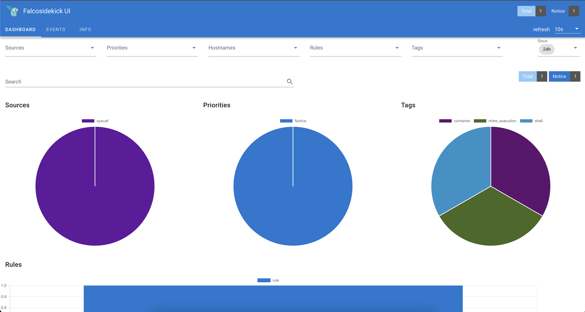

To access the Falcosidekick UI, create a port forward to expose the service:
```bash
kubectl port-forward svc/falco-falcosidekick-ui -n falco --address 0.0.0.0 2802 &> /dev/null &
```{{exec}}

Now, click [here]({{TRAFFIC_HOST1_2802}}) to access the UI (use `admin:admin` to log in).
Notice that there is already one event.
Click on events to see the events detail.



### Event Generator

It is better to explore the Falcosidekick UI with more events.
Run the following command to use [event-generator](https://github.com/falcosecurity/event-generator) to generate a variety of suspect actions that are detected by Falco rulesets.
```bash
docker run -it --rm falcosecurity/event-generator run syscall --loop
```{{exec}}

Explore Falcosidekick UI.
Notice the different priorities and tags.
